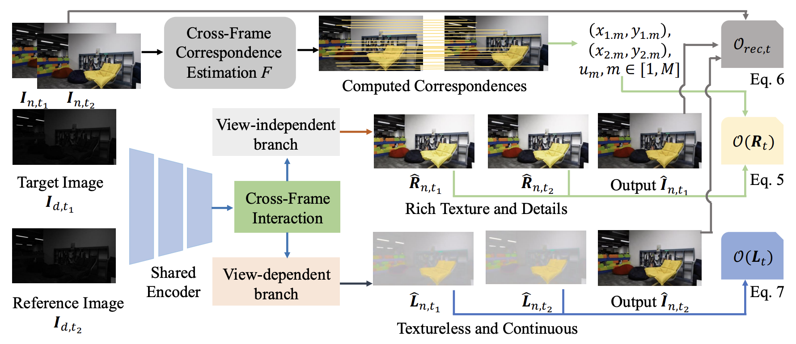

# Low-Light Video Enhancement via Spatial-Temporal Consistent Decomposition

This is a pytorch project for the paper **Low-Light Video Enhancement via Spatial-Temporal Consistent Decomposition** by Xiaogang Xu, Kun Zhou, Tao Hu, Jiafei Wu, Ruixing Wang, Hao Peng, and Bei Yu presented at **IJCAI2025**.
(The previous title is called "Low-Light Video Enhancement via Spatial-Temporal Consistent Illumination and Reflection Decomposition")

## Introduction
In this paper, we present an innovative video decomposition strategy that incorporates view-independent and view-dependent components to enhance the performance of LLVE. We leverage dynamic cross-frame correspondences for the view-independent term (which primarily captures intrinsic appearance) and impose a scene-level continuity constraint on the view-dependent term (which mainly describes the shading condition) to achieve consistent and satisfactory decomposition results. To further ensure consistent decomposition, we introduce a dual-structure enhancement network featuring a cross-frame interaction mechanism. By supervising different frames simultaneously, this network encourages them to exhibit matching decomposition features.



[paper link](https://arxiv.org/abs/2405.15660)


## Project Setup

First install Python 3. We advise you to install Python 3 and PyTorch with Anaconda:

```
conda create --name py36 python=3.6
source activate py36
```

Clone the repo and install the complementary requirements:
```
cd $HOME
git clone --recursive git@github.com:xiaogang00/LLVE_STCD.git
cd LLVE_STCD
pip install -r requirements.txt
```

Meanwhile, you should install the dependency of correspondence estimation model, e.g., DKM in this paper:
```
cd $HOME
git clone --recursive git@github.com:Parskatt/DKM.git
cd DKM
python setup.py install
```


## Usage

### Train

First, download the dataset. Take the dataset of SDSD-indoor in the low-light video enhancement task as an example.


You can download the SDSD-indoor dataset from [baidu pan](https://pan.baidu.com/s/1CSNP_mAJQy1ZcHf5kXSrFQ) (验证码: zcrb) and [google pan](https://drive.google.com/drive/folders/1-fQGjzNcyVcBjo_3Us0yM5jDu0CKXXrV?usp=sharing). There should contain "indoor/indoor_np" or "indoor_np".

Meanwhile, download the checkpoint of DKM model if it is not downloaded automatically. The download links for DKM indoor and outdoor are:
```
"outdoor": "https://github.com/Parskatt/storage/releases/download/dkmv3/DKMv3_outdoor.pth",
"indoor": "https://github.com/Parskatt/storage/releases/download/dkmv3/DKMv3_indoor.pth",
```
For the experiments on SDSD-indoor, you should choose DKM indoor model, and modify the path in "Video_base_model4_m2.py" (line 63). For example, in the path of 'pretrained_model/DKMv3_indoor.pth' for the keyword argument of 'path_to_weights'.

Train the model on the corresponding dataset using the train config.
For example, the training on SDSD-indoor:
```
python -m torch.distributed.launch --nproc_per_node 1 --master_port 4320 train.py -opt options/train/SDSD_indoor.yml --launcher pytorch
```

### Test

We use PSNR and SSIM as the metrics for evaluation. Evaluate the model on the corresponding dataset using the test config.

For instance, for the evaluation on SDSD-indoor, you can download the pretrained model on SDSD-indoor (the link is https://drive.google.com/file/d/1sUzhwKWxJOjITFL8ypb3UQeofz0KI7E4/view?usp=share_link) or use the trained model by yourself, writing the location of checkpoint in ``pretrain_model_G" of options/test/SDSD_indoor_test.yml
use the following command line:
```
python test.py -opt options/test/SDSD_indoor_test.yml
```

## Citation Information

If you find the project useful, please cite:

```
@inproceedings{xu2025low,
  title={Low-Light Video Enhancement via Spatial-Temporal Consistent Decomposition},
  author={Xu, Xiaogang and Zhou, Kun and Hu, Tao and Wu, Jiafei and Wang, Ruixing and Peng, Hao and Yu, Bei},
  booktitle={IJCAI},
  year={2025}
}
```

## Contributions
If you have any questions/comments/bug reports, feel free to e-mail the author Xiaogang Xu ([xiaogangxu00@gmail.com](xiaogangxu00@gmail.com)).
